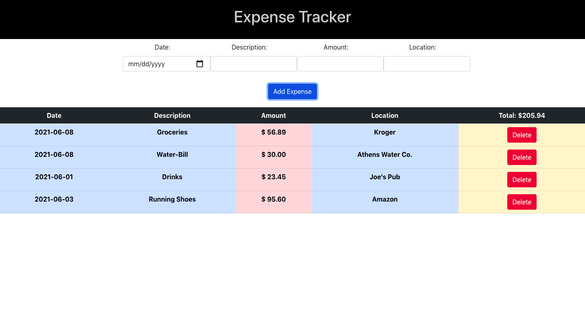

# React-Expense-Tracker

### This is a simple Expense Tracker application built using HTML, CSS, Bootstrap, and React.
 
#### You can test the app [here](https://nick-p-react-expense-tracker.herokuapp.com/) 

## Project Summary
This was an extremely fun and challenging app to build at this stage in my programming journey. This was the first 
application I have ever built using the React framework. This was also the first app that I built using Bootstrap. 
This was a welcome relief of some of the challenges of making a Mobile-Responsive application! I hope to add some features in the future such as a budget indicator, currency types with icons, and catagories that track percentages of Food, Utilities, Entertainment etc. 

## About Me

Nick Paolino -- Front-End Web Developer -- [LinkedIn](https://www.linkedin.com/in/nick-paolino-00469291/)